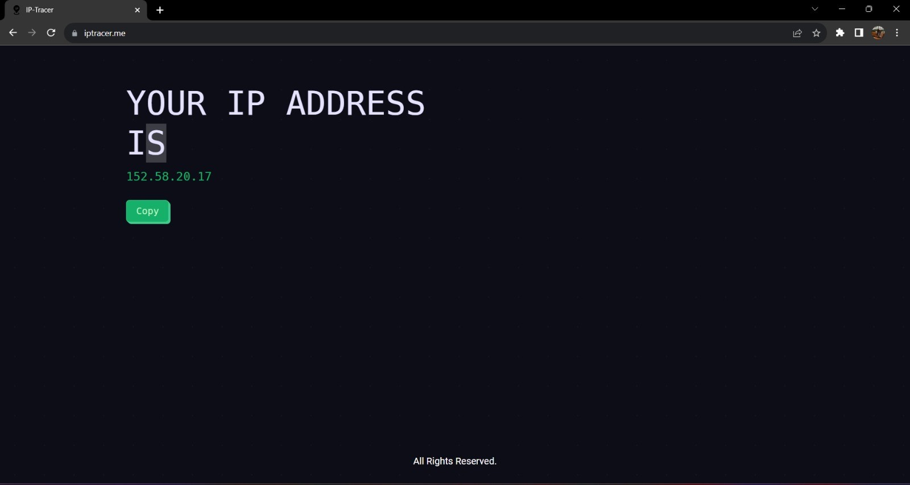

<h1 align="center">IP Tracer</h1>

  A user-friendly web application for tracing and displaying your IP address.

## Introduction

IP Tracer is a straightforward web application designed to provide you with real-time information about your current IP address. Its simplicity and user-friendly interface make it a useful tool for quick IP address checks. Additionally, IP Tracer allows you to copy your IP address to the clipboard with a single click, streamlining the process.

  

## Features

- **Real-time IP Address:** Get your current IP address in real-time without any hassle.
- **One-Click Copy:** Quickly copy your IP address to the clipboard, ready for use in other applications or services.

## Getting Started

### Prerequisites

- A modern web browser (Google Chrome, Mozilla Firefox, Safari, etc.).
- An active internet connection.

### Installation

IP Tracer does not require any installation. Simply visit the website [www.iptracer.me](https://www.iptracer.me) in your web browser, and the application will automatically display your current IP address.

## Usage

1. Open your preferred web browser.

2. Visit [www.iptracer.me](https://www.iptracer.me).

3. Your current IP address will be displayed in real time on the website.

4. To copy your IP address to the clipboard, click the "Copy" button.

5. You can now paste your IP address wherever it's needed.

## Contact

For questions, feedback, or support, please contact the project owner:

- Name: Hrushikesh Dagwar
- Email: hrushikeshdagwar@gmail.com

## Acknowledgments

- This project was built using HTML, CSS, and JavaScript.
- Special thanks to [ipify](https://www.ipify.org/) for providing IP address information.

We hope you find IP Tracer helpful!

---
